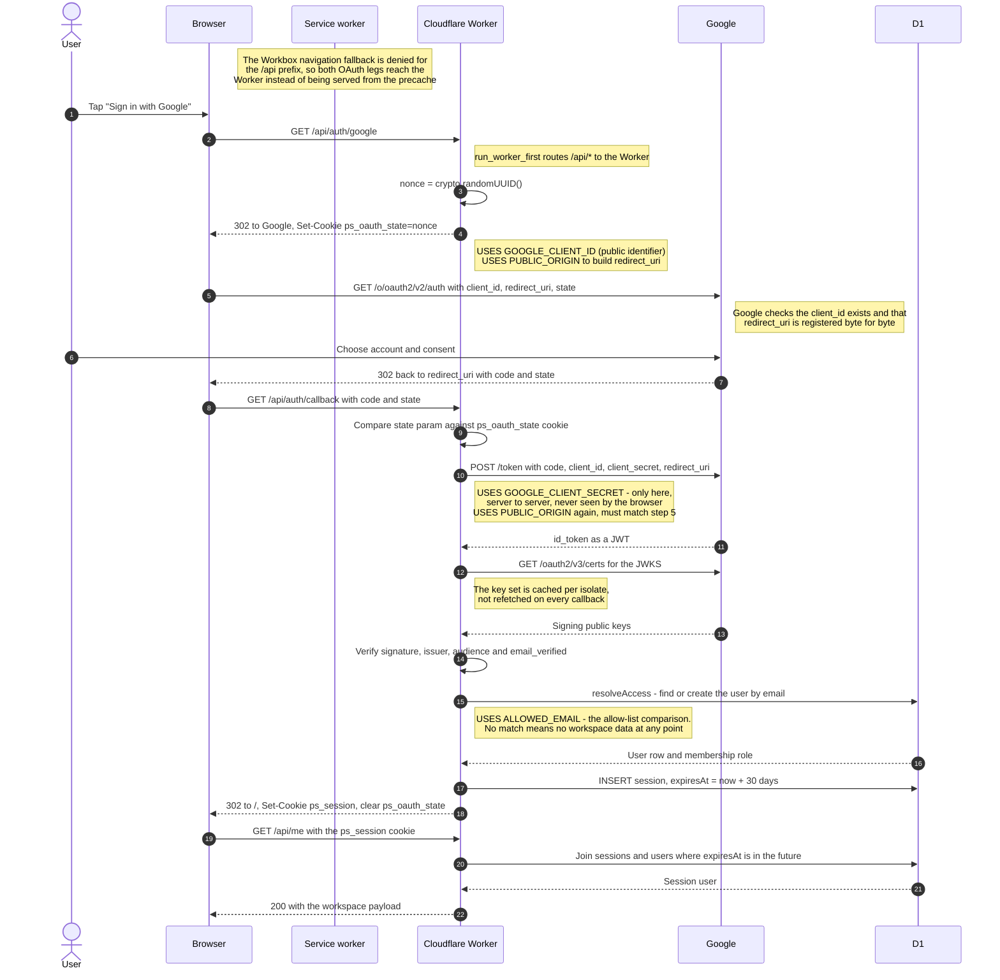
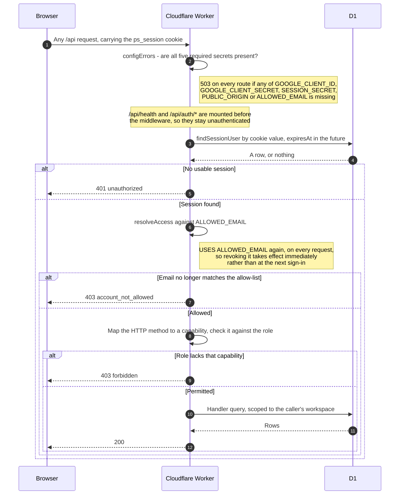

# Sign-in flow, keys and secrets

How Google sign-in actually works in the deployed app, and which key or secret is used at which
step. This describes the **implementation as it stands**;
[docs/architecture/auth.md](./architecture/auth.md) holds the fixed decisions behind it and wins on
_why_. Where the two disagree, this page records the drift explicitly at the end.

## Where configuration lives

Three separate stores, easily conflated. Nothing below is committed except the `wrangler.jsonc`
values, which are deliberately not secret.

### Worker secrets

Set with `wrangler secret put <NAME> --cwd packages/worker`, encrypted at rest, injected as `env.*`
on each request. The Worker refuses to serve at all — `503` on every route — if any of these five is
missing while `NODE_ENV=production`. Fail closed, never fail open.

| Secret                 | Genuinely secret | Used at        | Purpose                                                                                                                                                      |
| ---------------------- | ---------------- | -------------- | ------------------------------------------------------------------------------------------------------------------------------------------------------------ |
| `GOOGLE_CLIENT_ID`     | **No**           | Steps 5 and 12 | Identifies the OAuth client to Google. Travels in the redirect URL in plain sight, so it is public by design; it is stored as a secret only for convenience. |
| `GOOGLE_CLIENT_SECRET` | **Yes**          | Step 12 only   | Authenticates the Worker to Google during the code-for-token exchange. Server to server, never sent to the browser and never placed in a URL.                |
| `PUBLIC_ORIGIN`        | No               | Steps 5 and 12 | The app's own origin, used to build `redirect_uri`. Must match the URI registered in Google Cloud Console byte for byte.                                     |
| `ALLOWED_EMAIL`        | No               | Step 17        | The single address permitted to use the space. Compared case-insensitively.                                                                                  |
| `SESSION_SECRET`       | —                | **Nowhere**    | Required to be present, but no code reads it. See [Known wrinkles](#known-wrinkles).                                                                         |

### Worker configuration

Committed, in `packages/worker/wrangler.jsonc`. Not credentials.

| Key                          | Value             | Why it matters                                                                                                                                           |
| ---------------------------- | ----------------- | -------------------------------------------------------------------------------------------------------------------------------------------------------- |
| `NODE_ENV`                   | `production`      | Arms the fail-closed secret check. With any other value the check short-circuits and missing secrets go unnoticed.                                       |
| `d1_databases[].database_id` | the database UUID | Identifies the D1 database. A name rather than a UUID here fails migrations with `Invalid uuid [code: 7400]`.                                            |
| `assets.run_worker_first`    | `["/api/*"]`      | Sends every `/api` request to the Worker rather than to the static assets. Without it the asset router would answer first.                               |
| `AUTH_DISABLED`              | unset             | Development-only bypass that runs the app as a synthetic owner with no sign-in. Setting it while `NODE_ENV=production` makes the Worker refuse to serve. |

### CI secrets

GitHub Actions repository secrets, used only by `.github/workflows/deploy.yml`. The Worker never
sees them.

| Secret                  | Purpose                                                |
| ----------------------- | ------------------------------------------------------ |
| `CLOUDFLARE_API_TOKEN`  | Lets `wrangler-action` apply D1 migrations and deploy. |
| `CLOUDFLARE_ACCOUNT_ID` | Selects the Cloudflare account to deploy into.         |

### Cookies

Not secrets, but they carry the flow. Both are `httpOnly`, `Secure`, `SameSite=Lax`.

| Cookie           | Life      | Contents                                              | Role                                                                       |
| ---------------- | --------- | ----------------------------------------------------- | -------------------------------------------------------------------------- |
| `ps_oauth_state` | 5 minutes | a `crypto.randomUUID()` nonce                         | CSRF protection: the callback must present a `state` matching this cookie. |
| `ps_session`     | 30 days   | 32 random bytes as hex, from `crypto.getRandomValues` | The session token. Opaque and looked up server-side; it carries no claims. |

## The sign-in flow



### What each phase is for

**Steps 1 to 6 — starting the flow.** The button does a full-page redirect rather than a `fetch`,
because the consent screen has to own the top-level frame. The nonce is minted and stored in an
`httpOnly` cookie at the same time it is put in the `state` parameter, which is what makes step 11 a
double-submit check.

**Steps 7 to 9 — at Google.** Nothing of ours runs here. Both failure modes at this point are
Google's own error pages rather than our sign-in screen: an unknown `client_id` gives
`401 invalid_client`, and a `redirect_uri` that is not registered exactly gives
`redirect_uri_mismatch`.

**Steps 10 to 16 — proving the identity.** The authorization code is worthless on its own; exchanging
it requires the client secret, which is why the browser never holds a Google token. The returned ID
token is then verified cryptographically against Google's published keys, so a forged token fails
even if an attacker could reach the callback.

**Steps 17 to 19 — deciding access and issuing a session.** `resolveAccess` is the single place that
decides who gets in and with what role. The session token that follows is opaque: it is a lookup key,
not a claim, so it cannot be tampered with into saying something else.

## Every request after sign-in



A workspace the caller is not a member of returns **404, not 403**, so workspace IDs cannot be probed
by watching status codes.

**Sign-out** (`POST /api/auth/signout`) deletes the session row, so the cookie stops working even if
it was copied. A **Cron Trigger** at 03:00 UTC daily sweeps expired rows, keeping that work off the
request path.

## Failure codes on the sign-in screen

Every failure in the callback clears the state cookie and redirects to `/?auth_error=<code>`. The
Worker emits only the code; the wording lives in `SignInScreen.tsx`.

| Code               | Emitted when                                       | Usual cause                                                                                                                                                                                      |
| ------------------ | -------------------------------------------------- | ------------------------------------------------------------------------------------------------------------------------------------------------------------------------------------------------ |
| `expired`          | `state` param or cookie missing, or the two differ | The 5-minute window lapsed, the back button was used, or the flow was opened in another tab. A genuine CSRF attempt is indistinguishable and lands here too, with no session created either way. |
| `denied`           | Google returned an `error` parameter               | The user cancelled at the consent screen.                                                                                                                                                        |
| `no_code`          | no `code` parameter                                | Google did not complete the flow.                                                                                                                                                                |
| `provider_error`   | the token exchange or token verification threw     | Usually a wrong `GOOGLE_CLIENT_ID` or `GOOGLE_CLIENT_SECRET`, or a `redirect_uri` that does not match. The real reason is logged server-side and never put in the URL.                           |
| `email_unverified` | `email_verified` is false on the ID token          | The Google account's address is not verified. Not an access problem.                                                                                                                             |
| `not_allowed`      | `resolveAccess` returned null                      | The email does not match `ALLOWED_EMAIL`.                                                                                                                                                        |
| _anything else_    | —                                                  | The screen falls back to a generic retry message rather than rendering nothing.                                                                                                                  |

## Configuring it from scratch

1. In Google Cloud Console create an **OAuth client ID** of type _Web application_.
2. Register exactly one **authorized redirect URI**: `https://<your-origin>/api/auth/callback`.
   The initiation path (`/api/auth/google`) is **not** a redirect URI and does not belong in that
   list — Google only ever returns to the `redirect_uri` the app sends.
3. Copy the **Client ID** using the console's copy button rather than reading it off the screen; it
   is 32 random characters and a single misread one produces `401 invalid_client`.
4. Set the five secrets:

   ```
   npx wrangler secret put GOOGLE_CLIENT_ID     --cwd packages/worker
   npx wrangler secret put GOOGLE_CLIENT_SECRET --cwd packages/worker
   npx wrangler secret put PUBLIC_ORIGIN        --cwd packages/worker
   npx wrangler secret put ALLOWED_EMAIL        --cwd packages/worker
   npx wrangler secret put SESSION_SECRET       --cwd packages/worker
   ```

   `PUBLIC_ORIGIN` takes the full origin with scheme and no trailing slash, and must match step 2.

Locally, none of this is needed: set `AUTH_DISABLED=true` in `packages/worker/.dev.vars` and the app
runs as a synthetic owner with no Google credentials. See
[docs/RUNNING.md](./RUNNING.md).

## Known wrinkles

- **`SESSION_SECRET` is required but unused.** `env.ts` lists it among the secrets that must be
  present in production, so the Worker `503`s without it, yet nothing in `src/` reads it. It is a
  leftover from a design where the session was a signed cookie. Because sessions are 256-bit random
  tokens looked up in D1, there is nothing to sign — so this is dead configuration rather than a
  security gap. Removing it from `REQUIRED_IN_PRODUCTION` would be a small, safe cleanup.
- **`PUBLIC_ORIGIN` is used twice and must agree with itself.** It builds `redirect_uri` both when
  starting the flow and again during the token exchange, and Google requires the two to be identical
  and registered. A wrong value here fails at step 12, not step 5, which makes it look like a
  credentials problem.
- **The client ID is not a secret; the client secret is.** They are easy to swap when pasting. A
  client secret placed in `GOOGLE_CLIENT_ID` is published in the redirect URL on the very first
  request, and must be rotated — adding a new secret in the console is not enough, the old one has to
  be deleted.
- **The service worker can swallow the whole flow.** Both OAuth legs are top-level document
  navigations to `/api/...`. Workbox's navigation fallback will answer them from the precache unless
  `navigateFallbackDenylist` excludes the `/api` prefix, in which case the Worker never runs and the
  SPA renders a router "Not Found" instead. This is invisible to `curl`, which has no service worker.

## Where the implementation differs from the architecture doc

[docs/architecture/auth.md](./architecture/auth.md) is the fixed decision record. Two details of the
shipped code depart from its wording, neither weakening it:

- It calls for a **signed** `state` value. The implementation uses an unsigned random nonce held in
  an `httpOnly` cookie and compared on return. The property that matters — a callback cannot be
  forged without the browser's own cookie — is the same, and a signature would add nothing without a
  separate verification key.
- It describes a **sliding** 30-day expiry. The implementation sets a fixed `expiresAt` at sign-in
  and does not extend it on use, so an active user is signed out 30 days after signing in rather than
  after 30 days of inactivity. Making it sliding means refreshing `expiresAt` in `findSessionUser`.
